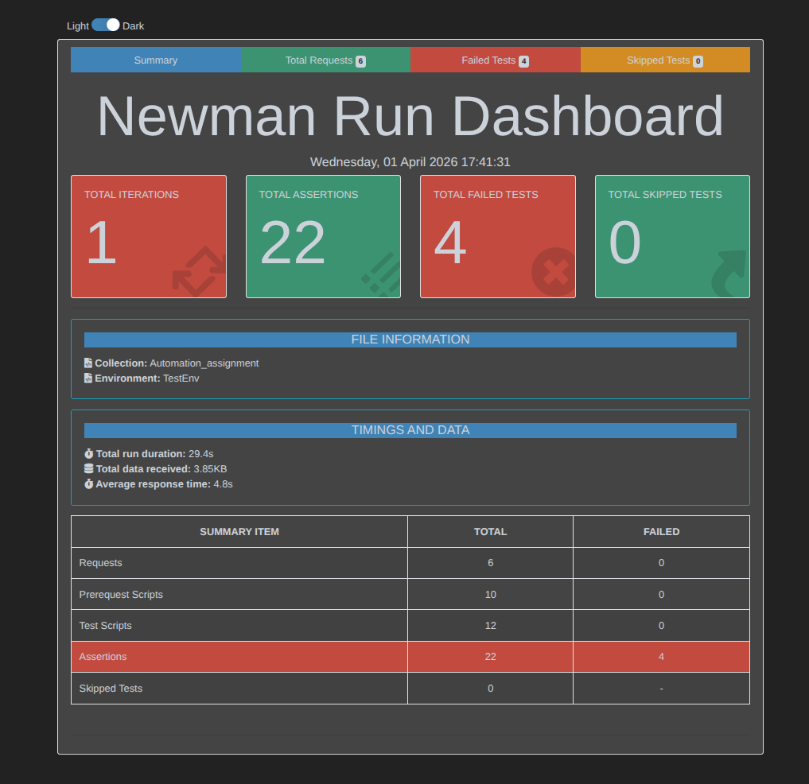

# Employee API Automation with Newman

## About This Project

This is employee api project so here create, update, screatch and deleting data. This automation framework validates complete Employee Management System API workflows using Postman collections integrated with Newman CLI runner. It performs comprehensive testing across all CRUD operations (Create, Read, Update, Delete) with automated test validation and detailed report generation for quality assurance. The project ensures API reliability, performance monitoring, and regression testing by executing predefined test scenarios in an automated manner with HTML detailed reporting capabilities.

## Prerequisite

- node.js

## Api Documentation

[Employee api documentation](https://documenter.getpostman.com/view/34701780/2sBXiojp15)

## How to Run the project

```bash
npm init -y
npm i newman
npm newman run [collection secret key]
npm i newman-reporter-htmlextra
node ./report.js
```

## Environment installation

```bash
npm i dotenv
```

## Test Scenarios Covered

- User Login
- Create Employee  
- Get Employee List
- Update Employee
- Delete Employee
- Query Parameters

## Newman Report




## Automation Video

<video src="automation_video.mp4" controls width="900">
	Your browser does not support the video tag.
</video>

[Download/Watch Video](automation_video.mp4)

## Author

**Emon Mahmud**


